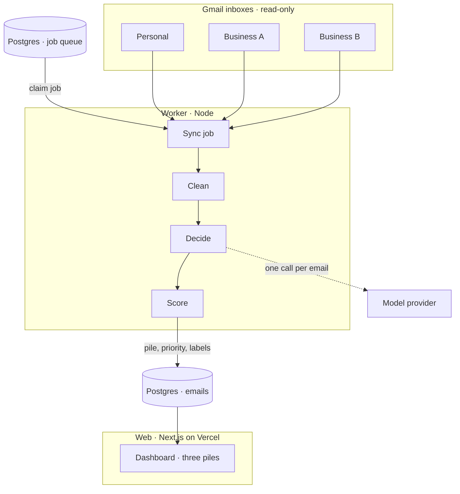
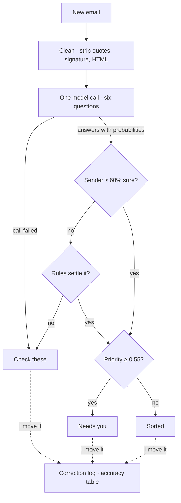

> **TL;DR** — Onefold connects several Gmail inboxes and sorts every email into three piles: needs you, check these, sorted. Each email is read once, by a model that answers a fixed set of questions with probabilities. Plain code turns those answers into a priority. Anything the model isn't sure about goes to a human instead of being guessed.

I run more than one thing, and each one has its own inbox. A personal Gmail, a couple of Google Workspace addresses, and more mail sitting in Zoho and Outlook.

The problem is not volume. It is that the one email that matters is always in the tab I didn't open. An investor reply sits under forty receipts. A customer complaint waits behind a newsletter.

So I built Onefold for myself. It started life as Founder Inbox, and it is live at [onefold-gamma.vercel.app](https://onefold-gamma.vercel.app).

## What it does

You sign in, connect several Gmail accounts with read-only access, and every incoming email lands in one of three piles:

- **Needs you** — ranked by priority, highest first
- **Check these** — the model wasn't confident, so a human decides
- **Sorted** — low-priority mail the model was confident about

Each inbox gets a brand and one line about what that business does. That is how the system tells my businesses apart when the same person writes to two of them.

Onefold never sends, deletes or moves mail. It only reads.

## System design

Mail moves in one direction: out of the inboxes, through the worker, into Postgres, onto the dashboard.



Three pieces share one package:

1. **Web** — a Next.js app for the dashboard, the API and sign-in. Signing in and connecting an inbox are two separate consents, so you can connect addresses other than the one you signed in with.
2. **Worker** — a long-running Node process that polls each inbox and runs backfill and sync jobs.
3. **Core** — the schema, the Gmail client, message cleaning, the decision client, scoring and the job queue.

Connecting an inbox or pressing **Sync now** in the web app adds a job to the queue and wakes the worker. Jobs and their progress live in Postgres, not in memory. If the worker sleeps or restarts, it picks up where it stopped. Nothing is lost, only delayed.

## The path of one email

The diagram above is the plumbing. This one is the decision: what happens to a single message between arriving and landing in a pile. The next four sections walk through it step by step.



## Clean before you ask

A raw email is mostly noise: quoted replies, signatures, "Sent from my iPhone", HTML.

Before any model sees a message, Onefold strips all of that and keeps at most 1,500 characters of the body. That is cheaper, and it means less of anyone's mail leaves the database.

The cleaning step also collects signals that need no model at all:

- Is there a `List-Unsubscribe` header?
- Is the sender a no-reply address?
- Which Gmail tab did it land in?
- Have I emailed this person before?

These matter later.

## Questions, not prompts

The obvious design is one big prompt: "Here is an email, is it important?" I didn't want that. A single answer hides how sure the model was, and I can't tune it afterwards.

Onefold is designed around **Jev**, TypeSafe's decision model. Jev doesn't write text. You hand it some state and a set of fixed-choice questions, and it returns probabilities for each one. Every email gets one call with all the questions at once:

- **Who sent this?** Investor, customer, candidate, partner or vendor, cold outreach, personal, automated, other
- **Does it expect a reply?** Yes or no, as a probability
- **How urgent is it?** Four levels, from "no time pressure" to "something is blocked right now"
- **Is money involved?**
- **Do they want a meeting?**
- **Which of my businesses is this about?** Asked only when more than one brand is set up

The answers are stored with the email. That turns out to be the most useful decision in the whole design.

## Scoring is just arithmetic

The model doesn't decide the pile. Code does.

```
priority = 0.45 × sender weight
         + 0.25 × needs reply
         + 0.20 × urgency
         + 0.05 × money
         + 0.05 × meeting
```

Sender weight is an expected value over the full distribution, not just the top label. An email that is 60% investor and 40% cold outreach scores lower than one that is 95% investor, which is what I want.

Then the plain rules get their say. A sender I have emailed before gets a boost. Bulk or no-reply mail is cut hard. Anything Gmail filed under Promotions is cut again.

Because the answers are stored, changing a threshold re-sorts every email without a single new model call.

## The third pile

Most triage tools have two piles: important and not. The third is the one I trust.

If the model is less than 60% sure who sent an email, and no rule is confident either, the email goes to **Check these** with the reason written on it: "Only 54% sure who this is from".

The same applies when the model call fails. The email is not dropped and not guessed. It goes to a human.

Every time I move an email or fix its sender, the correction is logged. The settings page turns that log into an accuracy table, so tuning is based on what the system actually got wrong.

## How Jev is working for me

Here is the honest state of it.

The real Jev model needs paid credits, and my first call was refused. I didn't want to stall on billing, so I built a second provider. Gemini 2.5 Flash, on a free tier, is asked the same questions, and its reply is converted into Jev's exact answer shapes. Sloppy replies are repaired; unusable ones are retried. Scoring, the dashboard and the accuracy page cannot tell the difference.

So the Jev *design* is what is working for me today, running on a stand-in model. What I have measured:

- **Sender type** — on 13 sample emails, 12 matched the expected sender. The thirteenth was a deliberately vague "Regarding the project", which landed in Check these at 54% confidence. That is the third pile doing its job.
- **Labels** — on 19 realistic emails (bank alerts, renewals, a failed payment, a refund, travel, orders), 19 of 19 were labelled correctly, with 8 of 8 amounts and 2 of 2 dates read correctly.
- **Cost** — about a tenth of a cent per email.

And the limits, because they are real:

- Both sets are small and written for the purpose. They are not a sample of real inboxes.
- A chat model's confidence is its own estimate, not a calibrated probability. It runs high, between 0.89 and 1.00 on the clear emails, so the 60% threshold catches less than it would with Jev.
- The free tier allows five requests a minute. A 200-email backfill takes about 40 minutes.
- The real Jev path is written and tested against the answer shapes, but it has not been run against the live service yet.

Switching is one environment variable and a **Re-decide** button, which runs stored emails through whichever model is active without fetching them again.

## Labels and details

Sorting told me *whether* to look. I also wanted to know *what* an email was.

The same call now applies any of 16 labels (debit, credit, invoice, subscription, refund, security alert, travel and so on) and reads out the amount, currency, counterparty, due date and whether the charge repeats. A row in the list shows −₹2,450 or +₹85,000 before I open anything.

One lesson from measuring: the model added "Account notice" to nearly every payment and security email. Early runs scored 16 and 17 out of 19, and every miss was that one extra label. I didn't fix it with a better prompt. I added one rule: drop "Account notice" whenever a more specific label is present. That took it to 19 of 19.

## What I learned

**Store the answers, not the verdict.** Keeping the probabilities means I can re-score, re-threshold and audit without paying for another call.

**Let the model be unsure.** A pile for low-confidence mail is worth more than two points of accuracy. It is the difference between a tool I check and a tool I trust.

**Put a seam where the vendor is.** One function decides an email. Behind it sit Jev, a chat model and a keyword mock that lets the whole app run with no key. Being refused by an API cost me an afternoon, not the project.

**Rules beat prompts for known failures.** When a model is wrong in the same way every time, one line of code is cheaper and more predictable than another paragraph of instructions.

## What's next

- **Zoho and Outlook** — the rest of my mail lives there, and Onefold only reads Gmail and Google Workspace today
- **Real Jev** — for calibrated confidence, once the credits are in place
- **Deploying the worker** — the web app and database are live; real-inbox syncing still runs locally
- **Drafted replies**, and writing labels back to Gmail

It is early, and I am the first user. But the tab I didn't open matters a lot less than it used to.
