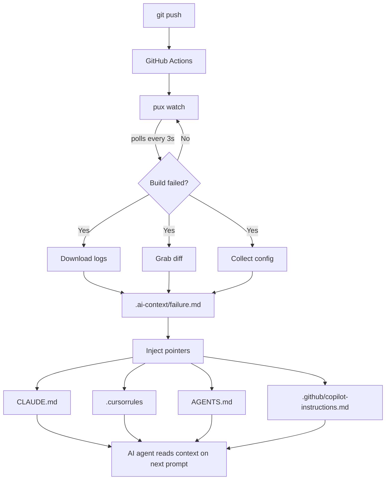

Every time a CI build fails, the same ritual plays out: open GitHub, find the run, scroll through logs, copy the error, paste it into your AI assistant. Twenty-five minutes and seven tabs later, you're finally debugging.

I built Pux to kill that loop entirely.

## The idea

Pux is a CLI that watches your GitHub Actions runs in real-time. When something fails, it pulls the logs, extracts the relevant stacktrace, grabs the diff that caused it, and writes everything to a structured `.ai-context/failure.md` file.

Your AI agent picks it up on the next prompt. No tabs, no scrolling, no copy-paste.

## System design



## How it works

The pipeline is straightforward:

1. **Watch** — `pux watch` polls the GitHub Actions API for active workflow runs
2. **Detect** — when a run fails, Pux identifies the failed job and step
3. **Extract** — downloads raw logs and parses out the error window (the relevant 50-100 lines around the failure point)
4. **Collect** — grabs the triggering commit diff and relevant config files (Dockerfile, CI workflow yaml, package.json)
5. **Write** — everything gets structured and written to `.ai-context/failure.md`
6. **Inject** — pointers to the context file are auto-injected into agent config files

The key insight: AI agents already read context files. Claude Code reads `CLAUDE.md`, Cursor reads `.cursorrules`, Copilot reads `.github/copilot-instructions.md`. Pux just writes to where they're already looking.

## Integrations

Pux auto-connects failure context to whichever AI coding agent you use:

- **Claude Code** — injects into `CLAUDE.md` and `AGENTS.md`
- **Cursor** — injects into `.cursorrules`
- **GitHub Copilot** — injects into `.github/copilot-instructions.md`
- **OpenAI Codex** — injects into `AGENTS.md`
- **Google Gemini** — injects into `.gemini/settings.json`
- **Windsurf** — injects into `.windsurfrules`
- **Cline** — injects into `.clinerules`

No configuration needed. Pux detects which agents are present in your project and writes to all of them.

## The cat

Every good CLI needs personality. Pux has an ASCII cat that lives in your terminal, watches your builds, and reacts to success and failure. It never interrupts — just sits there, keeping you company while CI runs.

```
 /\_/\     pux
( ^.^ )~  watching 1 pipeline
 > ^ < ♡  commit 9122b2d
```

## What I learned

Building developer tools is about removing friction, not adding features. The best tool is one you forget is running until it saves you twenty minutes.

Pux is open source. Try it with `npm install -g pux.sh`.
