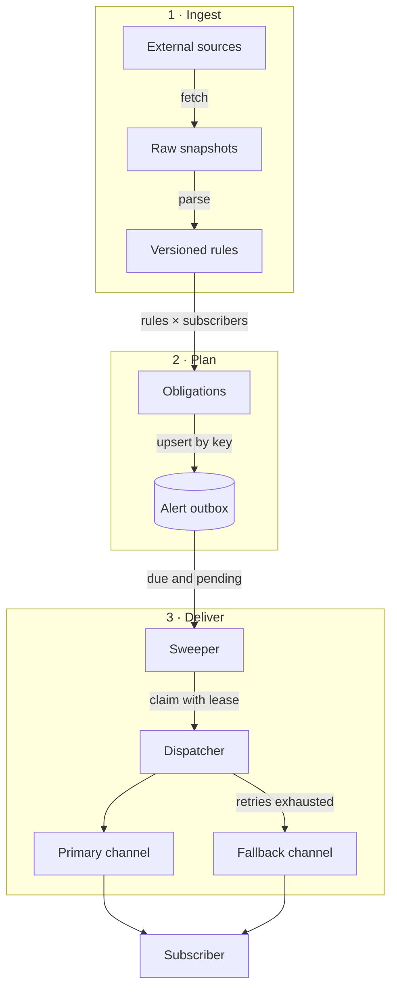
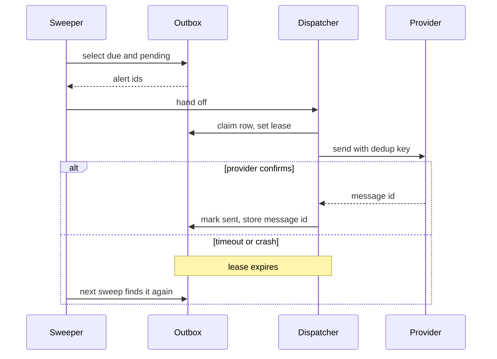
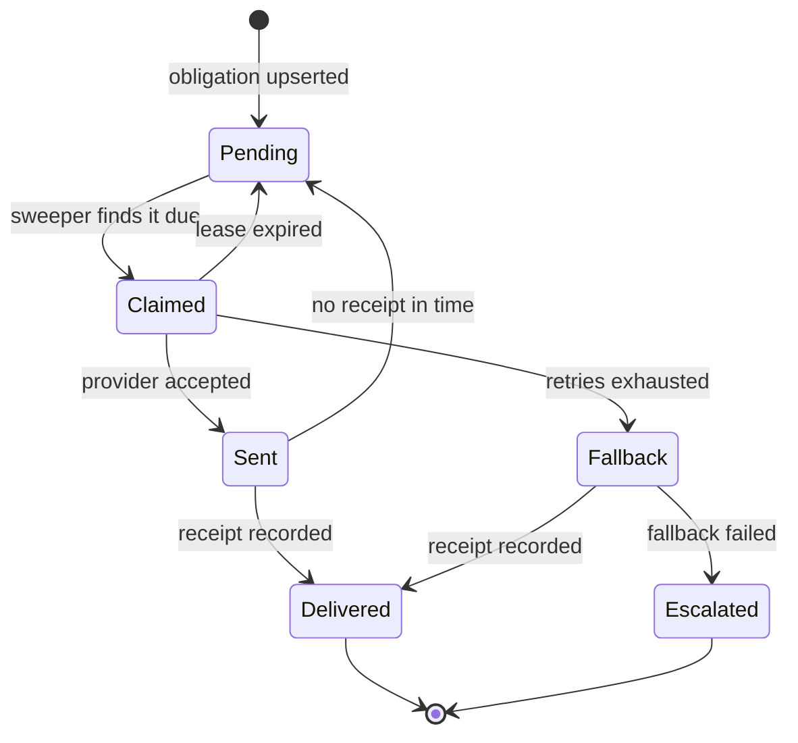
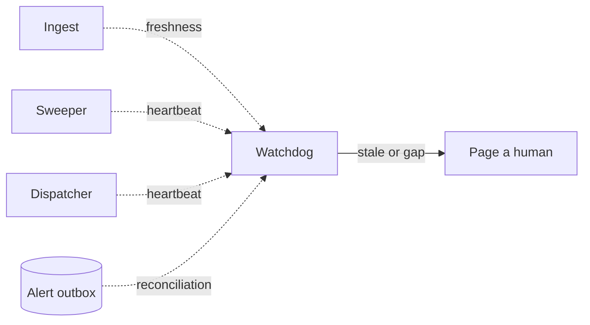

> **TL;DR** — A deadline engine fails quietly, so the design goal is not "always succeed". It is "never miss without someone finding out". That comes from four things: versioned ingest, idempotent planning, sweep-based scheduling with at-least-once delivery, and an independent check that assumes everything else failed.

Most systems fail loudly. A request errors, a page goes blank, someone files a ticket.

A deadline engine fails quietly. If an alert never goes out, nothing breaks. The dashboard looks the same as it does on a day when nothing is due. The first person to notice is the one who missed the deadline.

I recently built one of these. I can't talk about the product, but the system design stands on its own, so here it is.

## The constraint

The engine has one job: for every subscriber, know what is due and when, and tell them before it's too late.

That sounds like a cron job and a mail call. The hard part is the requirement hiding behind it:

> **A miss must never be silent.** The system is allowed to be late. It is allowed to send a duplicate. It is not allowed to skip an alert without anyone finding out.

### Three ways to miss silently

1. **The source lied or went away.** Dates come from external systems I don't control. They change format, go down, or revise a date after publishing it.
2. **The scheduler didn't fire.** A deploy, a crash, or a clock problem at the wrong minute.
3. **The send didn't land.** The provider timed out, and I don't know whether the message went out.

Each stage of the design exists to close one of these.

## System design

Three stages move data forward. A fourth piece sits outside the pipeline and watches the other three; it gets its own diagram further down.



## 1. Ingest: never trust, never delete

Every fetch stores the raw response as a snapshot before anything parses it. Parsing produces rule records, and rules are versioned rather than overwritten.

Two things follow from that:

- **A failed fetch never removes data.** The last good version stays in force and the source is marked stale.
- **A revised date is a new version.** It sits next to the old one, so I can see exactly what changed and when.

Each source carries a `last_fresh_at` timestamp. That number matters more than the data itself, because it is what tells me whether "nothing due" means nothing is due or the source has been dead for three days.

## 2. Plan: make recomputing safe

Rules are general. An **obligation** is a rule applied to one subscriber for one period, with a concrete due date.

Every obligation gets a deterministic key:

```text
obligation_key = hash(tenant_id, rule_id, period)
```

Generating obligations is an upsert on that key. I can rerun the whole computation whenever a rule changes and get the same rows back instead of a second copy.

Each obligation then fans out into alert rows, one per reminder offset and channel, written to an outbox table.

## 3. Deliver: sweep, claim, send

### Sweep, don't set timers

The obvious design is one timer per alert. It is also the fragile one: timers live in memory, and memory dies with the process.

Instead, alerts are rows with a `send_at` column, and a sweeper runs every few minutes asking one question:

```sql
select id
from alerts
where send_at <= now()
  and status = 'pending'
order by send_at
limit 500;
```

A missed tick doesn't lose anything. The next tick picks up everything the last one should have. The cost is precision, since an alert can be a few minutes late. For deadlines measured in days, that trade is free.

### At-least-once plus a dedup key

Exactly-once delivery over a network doesn't exist. What I can have is at-least-once delivery with idempotency, which looks the same from the outside.

Each alert row has a dedup key with a unique constraint on it:

```sql
create unique index alerts_dedup
  on alerts (obligation_id, offset_days, channel);
```

The dispatcher claims a row with a lease, sends, and writes back the provider's message id:



### The alert lifecycle

Every alert is always in exactly one state, and every state has a way out. Nothing can sit in `Claimed` forever, because the lease expires.



> **When in doubt, send again.** A duplicate reminder is an annoyance. A missing one is the failure the whole system exists to prevent.

## 4. Watch the watcher

Everything above still fails silently if the sweeper itself stops. So the last piece sits outside the pipeline and shares nothing with it.



- **Heartbeats.** Ingest, sweeper, and dispatcher each record when they last completed a run. The watchdog checks those timestamps.
- **Freshness alarms.** A source that hasn't been fresh within its expected window is treated as an incident, even though no code has errored.
- **Reconciliation.** A separate job counts alerts that should have gone out by now against alerts with a delivery receipt. Any gap pages a human.

Reconciliation is the important one. It doesn't care why an alert is missing. It only compares what should be true with what is:

```sql
select count(*)
from alerts
where send_at < now() - interval '30 minutes'
  and status not in ('delivered', 'escalated');
```

If that number is ever above zero, someone gets paged.

## Trade-offs

- **Late over lost.** Sweeping gives up minute-level precision for self-healing.
- **Duplicate over missing.** Uncertain sends are retried.
- **Correct, don't rewrite.** If a date changes after an alert went out, the subscriber gets a correction. The original alert stays in the history as sent.
- **Boring storage over clever queues.** State lives in rows I can query, so every question about the system is a `select`.

## What I learned

Reliability here came less from making each step succeed and more from making each step safe to repeat, then adding one check that assumes all of it failed anyway.

The question I now ask of any background system is simple:

> If this stopped running right now, who would find out, and how long would it take?
